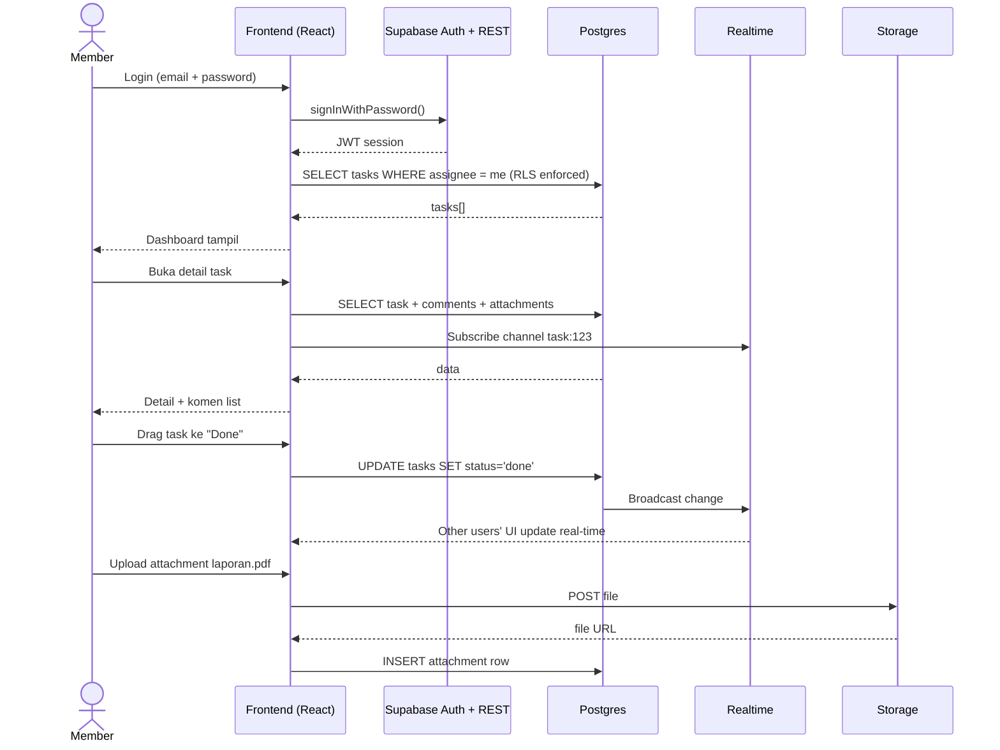
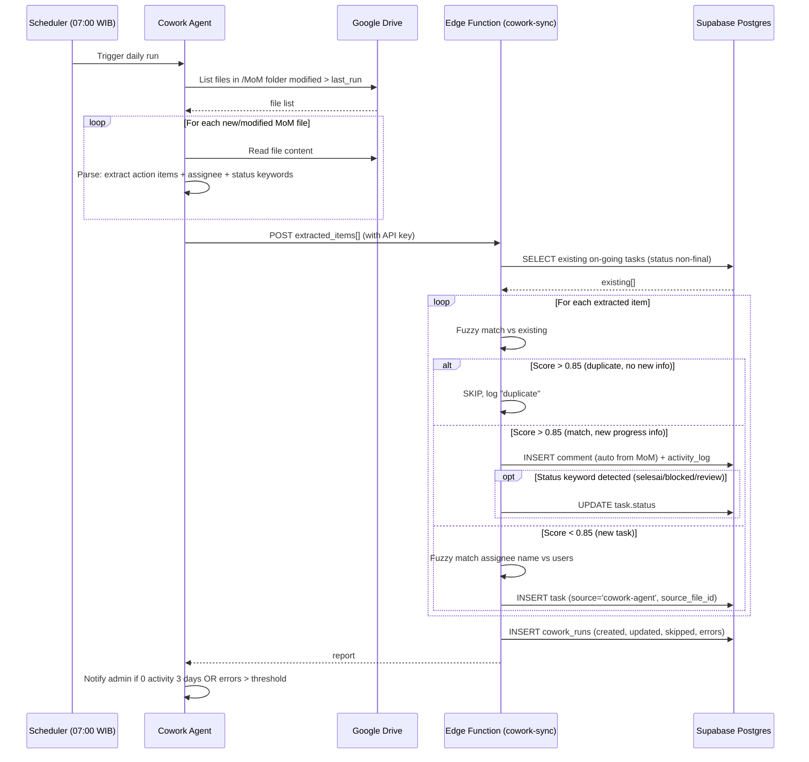
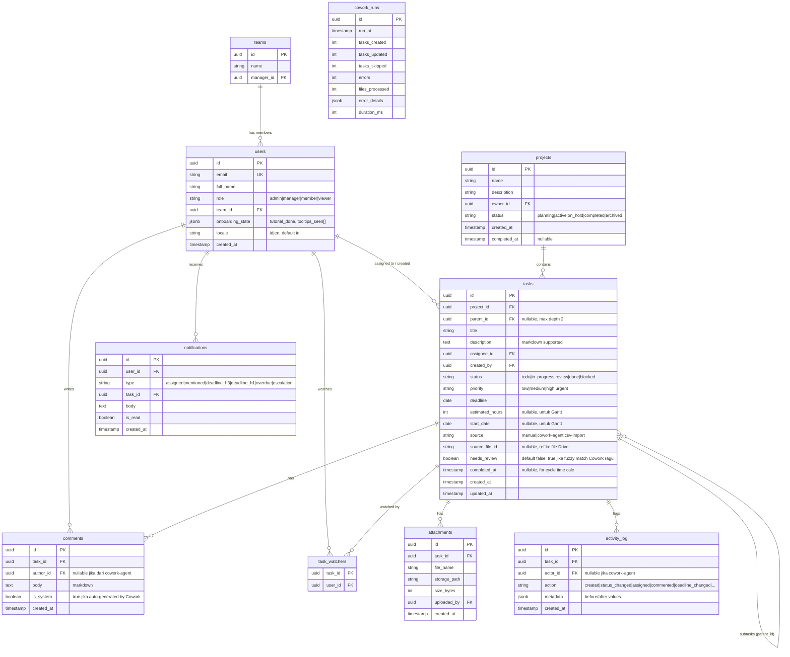

# PRD — Internal Task Management Pilot (Codename: "Trackr")

> **Status:** Draft v0.2
> **Owner (BD):** {Nama PIC BD — to fill}
> **Stakeholder Divisi:** {PIC tim early adopter — to fill}
> **Tanggal:** 2026-04-27
> **Version:** v0.2 (audit & gap-filling vs v0.1)
> **Pilot atau Production-spec:** Pilot scope + production roadmap

---

## 1. Overview

Saat ini koordinasi task antar karyawan di perusahaan masih dilakukan via chat (WhatsApp/Slack), email, dan meeting verbal — tidak ada single source of truth untuk siapa mengerjakan apa, kapan deadline-nya, dan di mana bottleneck-nya. Akibatnya: status project tidak terlihat, deadline terlewat tanpa early warning, beban kerja antar karyawan tidak terdistribusi merata, dan manajemen tidak punya visibility produktivitas tim secara real-time.

Tools komersial seperti Asana dan Monday menyelesaikan masalah ini, tetapi biaya lisensi-nya signifikan untuk skala 10-30 user dan ada risiko *sunk cost* kalau adopsi gagal. Pilot ini membangun task management internal yang ringan, gratis (memanfaatkan free tier Supabase), dan didesain spesifik untuk workflow perusahaan — termasuk integrasi otomasi: pembacaan notulensi/MoM dari folder Google Drive yang otomatis menjadi task harian (dieksekusi oleh Cowork agent).

**Tujuan utama:** Memberikan visibility task & beban kerja tim untuk 10-30 karyawan dengan zero recurring license cost selama 6-12 bulan pilot, sambil mengumpulkan data adopsi untuk justifikasi keputusan build vs buy di production.

---

## 2. Pain Point & Justifikasi

### 2.1 Kondisi as-is

- **Sumber data sekarang:** WhatsApp group, email thread, meeting notes di Google Docs, ad-hoc Spreadsheet per tim.
- **Cara kerja sekarang:**
  1. Manager assign task verbal di meeting atau via chat.
  2. Karyawan catat manual di Notes pribadi atau langsung kerjakan.
  3. Update progress disampaikan saat ditanya atau di standup (jika ada).
  4. File terkait scattered di chat attachment, Drive folder, email lampiran.
  5. Konsolidasi status mingguan dilakukan manual oleh BD/manager.
- **Stakeholder yang terlibat:** semua karyawan (member), team leads (manager), BD (admin pilot), manajemen (read-only viewer).

### 2.2 Pain point konkret

| # | Pain point | Dampak terukur | Sumber data |
|---|---|---|---|
| 1 | Task tidak punya single source of truth | **Belum diukur** — perlu sample tracking 1-2 minggu untuk hitung berapa kali task "hilang" atau di-rework karena lupa | Asumsi yang perlu divalidasi |
| 2 | Manager tidak punya visibility load tiap karyawan | **Belum diukur** — perlu survey atau interview ke 5-10 manager | Asumsi yang perlu divalidasi |
| 3 | Deadline terlewat tanpa early warning | **Belum diukur** — perlu audit project Q1-Q2 sample | Asumsi yang perlu divalidasi |
| 4 | Status update mingguan masih manual | **Belum diukur** — perlu time tracking konsolidasi laporan dari sample 4 manager | Asumsi yang perlu divalidasi |
| 5 | File terkait task scattered di chat/email/drive | **Belum diukur** — perlu interview kualitatif untuk frekuensi "search file lama" | Asumsi yang perlu divalidasi |

> **Catatan transparansi:** semua pain point di atas adalah hipotesis yang perlu divalidasi sebelum manajemen approval. Lihat section 10.3 untuk data yang masih perlu dikumpulkan.

### 2.3 Before vs After (target, perlu validasi data baseline)

| Metrik | Sebelum | Setelah (target pilot) | Improvement target |
|---|---|---|---|
| Sumber kebenaran status task | Tersebar di 4+ channel | 1 dashboard | -75% channel |
| Waktu konsolidasi status mingguan oleh manager | TBD jam/minggu | < 15 menit (auto-generated view) | TBD% |
| Visibility beban kerja per karyawan | Tidak ada | Workload view real-time | n/a |
| Lead time create task dari MoM | Manual, often skipped | Otomatis via Cowork harian | n/a |

> Angka "TBD" tidak akan diisi tanpa data baseline. Lihat section 10.3.

### 2.4 ROI calculation (formula eksplisit, dengan rentang sensitivitas)

```
Asumsi yang perlu divalidasi:
- Jumlah user pilot: 20 (midpoint 10-30)
- Jumlah manager dalam pilot: 4 (asumsi: 1 manager per 5 member)
- Waktu konsolidasi status mingguan oleh manager (manual): T1 menit/manager/minggu
- Waktu konsolidasi setelah pakai pilot: T2 menit/manager/minggu (estimasi: 15 menit baca dashboard)
- Cost per jam manager: Rp X (asumsi standar perusahaan, BELUM divalidasi)
- Waktu hilang member karena search task/file: T3 menit/member/minggu

Perhitungan saved time:
Saved time/minggu (manager) = 4 × (T1 - 15) / 60 jam
Saved time/minggu (member)  = 20 × T3 / 60 jam (asumsi pilot mengurangi T3 sebesar 50%)
Saved time/bulan = (saved time/minggu) × 4 minggu
Saved cost/tahun = saved time/bulan × Rp X/jam × 12 bulan

Cost pilot (Year 1):
- Supabase Free tier: Rp 0
- Domain custom (opsional): Rp 200K/tahun
- Development time (Claude Code/internal): asumsi 40-80 jam BD time @ Rp Y/jam
- Onboarding & training: 2 sesi × 2 jam × 20 user
```

**Hasil estimasi 3 skenario (HARUS divalidasi dengan data real sebelum management presentation):**

| Skenario | Asumsi T1 (menit/manager/minggu) | Asumsi T3 (menit/member/minggu) | Saved hours/bulan | Catatan |
|---|---|---|---|---|
| **Worst** | 60 | 30 | (4 × 45/60 + 20 × 15/60) × 4 = **32 jam/bulan** | Konservatif, asumsi tim sudah cukup teratur |
| **Base** | 120 | 60 | (4 × 105/60 + 20 × 30/60) × 4 = **68 jam/bulan** | Asumsi tengah, perlu validasi |
| **Best** | 180 | 90 | (4 × 165/60 + 20 × 45/60) × 4 = **104 jam/bulan** | Asumsi koordinasi sangat fragmented saat ini |

Konversi ke Rupiah baru bisa dilakukan setelah dapat data cost-per-hour rata-rata karyawan dari HR/Finance. **Saya tidak akan memberikan angka rupiah tanpa data ini** — itu akan jadi tebakan.

### 2.5 Comparison vs alternatif komersial (build vs buy)

Pricing di-verify dari sumber resmi & review independen per April 2026:

| Tool | Plan minimum yang punya Gantt + automation | Cost per user/bulan (annual) | Cost untuk 20 user/tahun (USD) | Catatan |
|---|---|---|---|---|
| Asana | Starter | $10.99/user/month | ~$2,638 | SSO/SAML hanya di Enterprise tier, tidak available di Starter |
| Asana | Advanced (untuk portfolio + workload view) | $24.99/user/month billed annually | ~$5,998 | Workload & portfolio butuh tier ini |
| Monday.com | (perlu di-verify saat sebelum management deck) | TBD | TBD | Belum di-search di iterasi PRD ini |
| **Pilot Trackr (build sendiri)** | n/a | Supabase free tier $0 | **$0** (selama dalam free tier limit) | Limit: 500MB database, 1GB file storage, 50,000 MAUs — sangat cukup untuk 20 user |

**Catatan penting tentang free tier:** Project free tier Supabase otomatis pause setelah 7 hari tidak ada aktivitas. Untuk pilot dengan user aktif harian, ini tidak akan terjadi, tapi perlu di-monitor. Jika pilot scale-up, upgrade ke Pro plan = $25/bulan flat (bukan per user) — masih jauh lebih murah dari Asana untuk 20 user.

---

## 3. Requirements

### 3.1 Functional requirements

- **F1.** User dapat membuat, edit, dan delete task dengan field minimum: title, description, assignee (PIC), deadline, status, priority, project parent. Mendukung subtask (parent-child) dengan kedalaman maksimum 2 level untuk pilot.
- **F2.** Task mendukung komentar (markdown-supported) dan file attachment (max 10MB per file, sesuai limit storage budget).
- **F3.** User dapat melihat task dalam 3 view: List (dengan grouping by project/assignee/status), Kanban (drag-drop antar status), Gantt chart (read-only di pilot, drag-resize di Phase 2).
- **F4.** Sistem mendukung 4 role: Admin (full access + user management), Manager (lihat & assign task tim-nya), Member (lihat & update task yang assigned ke dirinya), Viewer (manajemen, read-only ke semua dashboard).
- **F5.** Workload view: tampilkan jumlah task open per user dengan breakdown per status & priority.
- **F6.** Bottleneck view: tampilkan task yang stuck di status tertentu > X hari (X configurable, default 3 hari).
- **F7.** Notification escalation: in-app notification dengan tier urgency:
  - Saat task di-assign atau di-mention di komen → notif normal
  - H-3 sebelum deadline → notif normal (kuning)
  - H-1 sebelum deadline → notif urgent (orange)
  - Overdue → notif critical (merah), eskalasi ke manager assignee setelah 2 hari overdue
- **F8.** Manager dashboard: task tim mereka per status, completion rate, overdue count, workload distribution.
- **F9.** **MoM Import (renamed v0.3 dari "Cowork integration"):** Sprint 5 ships **manual admin upload UI** + backend RPC. Post-launch automation = Claude Code scheduled task reads Drive folder, reuses same backend RPC (zero throwaway code).
  - **Master alias mapping (`user_aliases` table):** auto-populated dari `users.full_name` + first_name + 4 honorifics via DB trigger; seed-able dari `MAPPING_KARYAWAN_FINAL_V2.csv` master file.
  - **4-tier confidence ketat:** HIGH=exact alias, MEDIUM=single fuzzy Levenshtein ≤1, LOW=multi-candidate atau distance 2, UNRESOLVED=no match (atau `[NAMA_TIDAK_JELAS_at_HH:MM]` escape hatch).
  - **Exception-only auto-approve:** semua HIGH → `auto_approved`; ada MEDIUM/LOW/UNRESOLVED → admin review queue.
  - **Decision per item:** create / skip / reject — admin commits via Approve & Commit button.
  - **(a) Create:** action item HIGH atau admin-decision=create → insert task `source='mom-import'`, `source_mom_import_id` + `source_action_id` composite dedup.
  - **(b) Update:** UPDATE flow defer (Sprint 6+). Sprint 5 cover Create + Skip.
  - **(c) Skip:** admin pilih skip → no task created, audit di `mom_import_items.decision='skip'`.
- **F10.** Onboarding pertama kali untuk first-time user, terdiri dari:
  - **(a)** Sample project + 5 sample task pre-populated otomatis (bisa di-delete)
  - **(b)** Wizard tour 5 langkah: bikin task, ubah view, komen, attach file, lihat workload
  - **(c)** Empty state setiap view dengan CTA + 1-line instruction (mis. "Belum ada task. Klik tombol + atau biarkan Cowork buat dari MoM besok pagi")
  - **(d)** Tooltip first-time pada setiap fitur kompleks (Gantt, drag-drop)
- **F11.** Search & filter:
  - **(a)** Global search bar di top nav: cari task by keyword di title/description, across all projects yang user punya akses
  - **(b)** Filter per view: assignee, project, status, priority, deadline range, source (manual vs cowork-agent)
  - **(c)** Saved filter (per-user) untuk filter yang sering dipakai
- **F12.** Activity log per task (siapa ubah apa, kapan) untuk audit trail. Retention: 90 hari di tabel utama, archived ke JSON export setelahnya untuk hemat 500MB DB limit.
- **F13.** **(BARU) Productivity & Management Dashboard:**
  - **(a)** Completion rate per user (tasks done / tasks assigned dalam periode dipilih)
  - **(b)** Velocity per team (tasks completed per minggu, trend 8 minggu)
  - **(c)** On-time delivery rate (% task selesai pada/sebelum deadline)
  - **(d)** Average cycle time (rata-rata hari dari created → done) per project
  - **(e)** Read-only access untuk role Viewer (manajemen)
  - **Catatan:** semua metric di-compute on-demand via SQL query, tidak di-cache, untuk hemat compute. Performance acceptable hingga 10.000 task historical.
- **F14.** **(BARU) Project lifecycle:** project punya status (planning / active / on-hold / completed / archived). Hanya project status `active` dihitung di productivity dashboard.
- **F15.** **(BARU) CSV import dari Spreadsheet eksisting:** admin bisa upload CSV dengan template kolom standar (title, assignee_email, deadline, project, priority, status) untuk migrasi data dari Sheet ke pilot saat onboarding.
- **F16.** **(BARU) Usage monitoring untuk admin:** halaman `/admin/usage` tampilkan: DB size current vs 500MB limit, storage current vs 1GB limit, jumlah MAU bulan berjalan, alert visual jika > 70% threshold.

### 3.2 Non-functional requirements

- **N1. Performance:** dashboard load < 2 detik untuk dataset sampai 1.000 task. Real-time update komen/status via Supabase Realtime, target latency < 1 detik. Productivity dashboard query < 3 detik untuk historical data sampai 10.000 task.
- **N2. Accessibility & Mobile:** web-first, responsive design (desktop + mobile browser). **PWA installable di pilot** (bukan ditunda Phase 2) — karyawan banyak akses dari HP, PWA installable mengurangi friction tanpa effort native app development.
- **N3. Security:** authentication via Supabase Auth (email + password minimum, magic link sebagai opsi). Row-Level Security (RLS) di Postgres untuk enforce role-based access di level database, bukan hanya UI.
- **N4. Concurrency:** target 30 concurrent user tanpa degradasi performance. Supabase free tier shared CPU sudah cukup untuk skala ini berdasarkan dokumentasi resmi.
- **N5. Data residency:** **PERLU KONFIRMASI IT** — Supabase free tier hosting di luar Indonesia (region terdekat: Singapore). Jika perusahaan punya policy data-must-be-in-ID, perlu reconsider arsitektur (lihat section 10.3).
- **N6. Backup:** free tier tidak punya daily backup. Mitigasi pilot: weekly manual `pg_dump` via GitHub Action ke private repo (terdokumentasi di section 12).
- **N7. (BARU) Localization:**
  - **Bahasa UI:** Bahasa Indonesia sebagai default, English toggle-able di profile setting.
  - **Date format:** DD-MM-YYYY (e.g., "27-04-2026"). Relative date untuk recent: "Kemarin", "2 hari lalu", "3 jam lagi".
  - **Timezone:** Asia/Jakarta (WIB, UTC+7) hardcoded di pilot. Multi-timezone di Phase 2 jika ada cabang luar negeri.
  - **Number format:** locale Indonesia (titik untuk thousand separator, koma untuk decimal kalau ada).
- **N8. (BARU) Browser support:** Chrome 110+, Firefox 110+, Safari 16+, Edge 110+. IE tidak didukung. Minimum mobile: iOS Safari 16+, Chrome Android 110+.

### 3.3 Out of scope (eksplisit untuk pilot)

**Out of scope karena phase consideration (akan masuk roadmap Phase 2/3):**
- Native mobile app iOS/Android (PWA installable cukup untuk pilot — lihat N2)
- Time tracking detail per task (manual `estimated_hours` cukup di pilot)
- Goal/OKR tracking & portfolio rollup
- SSO/SAML enterprise (pakai email/password sederhana di pilot)
- Push notification eksternal (Slack/WhatsApp/Email) — in-app only di pilot
- Custom field per project (semua project pakai schema sama)
- Public/external user / guest user
- Reporting export ke PDF/Excel (manual export via Supabase dashboard cukup di pilot)
- Multi-timezone (hardcoded WIB di pilot)
- Multi-tenancy

**Out of scope yang sering ditanya tapi sengaja dikeluarkan:**
- **Recurring task** (task yang otomatis create lagi tiap minggu/bulan) — kompleksitas tidak sebanding dengan benefit di pilot. Workaround: pakai Cowork agent dengan template MoM rutin.
- **Task dependencies di Gantt** (blocked-by, blocks, finish-to-start) — Gantt di pilot read-only & dependency-free. Phase 2 pakai library lebih kaya (dhtmlx-gantt) atau custom build.
- **Project templates** (duplicate project + tasks jadi project baru)
- **Budget/cost estimation per project**
- **Email-to-task** (forward email jadi task)
- **AI-assisted task breakdown** untuk task manual (Cowork sudah cover MoM)

---

## 4. Core Features

### Feature 1 — Task CRUD + Assignment

**Deskripsi:** User membuat task dengan minimum required field (title, assignee, deadline, project). Edit dan delete restricted by role.

**Acceptance criteria:**
- [ ] Given user authenticated sebagai Manager/Admin, when create task dengan field lengkap, then task tersimpan dan muncul di list assignee.
- [ ] Given user adalah Member, when mencoba edit task milik orang lain, then tombol edit tidak tampil dan API mereject (403).
- [ ] Given task baru di-create dan di-assign ke user X, when X buka aplikasi, then notification badge muncul.

### Feature 2 — Three Views (List / Kanban / Gantt)

**Deskripsi:** Toggle view pada level project. Filter persistent saat switch view.

**Acceptance criteria:**
- [ ] Given list of task, when user klik view "Kanban", then task ter-group by status dalam kolom (Todo / In Progress / Review / Done).
- [ ] Given Kanban view, when user drag task dari kolom "Todo" ke "In Progress", then status di DB update dan notif ke watchers.
- [ ] Given Gantt view, when task punya deadline + estimasi durasi, then bar muncul di timeline. Task tanpa estimasi muncul sebagai milestone (titik).

### Feature 3 — Comments + Attachments

**Deskripsi:** Diskusi kontekstual per task. File attachment via Supabase Storage.

**Acceptance criteria:**
- [ ] Given user buka detail task, when tulis komen dan kirim, then komen muncul real-time tanpa refresh untuk user lain yang buka task sama.
- [ ] Given user upload file attachment, when ukuran file > 10MB, then upload reject dengan pesan jelas. (10MB limit dipilih untuk konservasi 1GB Supabase Storage free tier.)
- [ ] Given user @mention user lain di komen, then user tersebut dapat notification.

### Feature 4 — Workload & Bottleneck Views

**Deskripsi:** Dashboard untuk Manager/Admin melihat distribusi beban dan task yang stuck.

**Acceptance criteria:**
- [ ] Given manager buka workload view, then tampil bar chart: jumlah open task per member di tim mereka.
- [ ] Given task dalam status non-final (Todo/In Progress/Review) lebih dari 3 hari tanpa update, then task masuk ke "Bottleneck" tab dengan highlight visual.
- [ ] Given member punya > N open task (N = threshold configurable, default 10), then member di-flag di workload view dengan warning indicator.

### Feature 5 — Cowork Integration: Sync Task dari MoM (CREATE + UPDATE + SKIP)

**Deskripsi:** Daily scheduled job jam 07:00 WIB. Cowork agent baca semua file baru/modified di folder `Drive/MoM/` sejak last run, parse content, dan lakukan 3 jenis aksi:

1. **CREATE** — action item baru → insert task baru dengan `source='cowork-agent'`, `source_file_id={drive_file_id}`
2. **UPDATE** — MoM mention progress/status untuk task existing (matched via fuzzy title + assignee) → tambah comment otomatis dengan excerpt MoM. Jika MoM mengandung keyword status eksplisit (e.g., "selesai", "completed", "blocked", "stuck", "in progress", "review"), update status task. Setiap auto-update di-log di `activity_log` dengan actor=`cowork-agent`.
3. **SKIP** — duplicate persis (fuzzy score > 0.85, no new info) → skip, log "duplicate"

**Acceptance criteria:**
- [ ] Given file MoM baru/modified di folder Drive sejak last run, when scheduled job jalan, then Cowork agent baca file tersebut.
- [ ] Given action item MOTIONALLY MATCHES task existing (fuzzy match score > 0.85, same assignee, status non-final), when MoM mention update progress, then Cowork tambah comment ke task tersebut dengan format: `[Auto from MoM {file_name} ({date})]: {excerpt}`.
- [ ] Given action item match task existing AND mengandung status keyword eksplisit, when keyword "selesai/done/completed" → update status ke `done`. Keyword "blocked/stuck" → update status ke `blocked`. Keyword "review" → update status ke `review`. Other keywords tidak trigger status change.
- [ ] Given action item baru (tidak match existing), when Cowork ekstrak assignee dari nama di MoM, then fuzzy match ke `users.full_name`. Score > 0.7 = assign langsung. Score 0.5-0.7 = assign dengan flag `needs_review`. Score < 0.5 = assign ke "Unassigned" dengan flag review.
- [ ] Given duplicate exact (fuzzy score > 0.85, no new info), then SKIP create, log "duplicate".
- [ ] Setiap run, Cowork tulis row di `cowork_runs` dengan: tasks_created, tasks_updated, tasks_skipped, errors, error_details (jsonb).
- [ ] Jika 3 hari berturut-turut 0 task created/updated, kirim alert ke admin (kemungkinan agent broken atau folder path salah).
- [ ] Dry-run mode tersedia untuk admin: jalankan tanpa write DB, cuma preview hasil parsing.

### Feature 6 — Onboarding & First-time Experience

**Deskripsi:** Karena tim belum pernah pakai task management tool, onboarding adalah feature critical (bukan nice-to-have). Terdiri dari 4 komponen:

1. **Sample data pre-populated** — saat user signup pertama kali, otomatis di-create:
   - 1 sample project bernama "🌱 Project Contoh — Hapus saja"
   - 5 sample task dengan variasi status (todo/in_progress/review/done/blocked)
   - 1 sample comment di salah satu task
   - User bisa delete project ini kapan saja tanpa konsekuensi
2. **Wizard tour 5 langkah** — overlay tutorial saat first login, cover: (a) bikin task, (b) switch view ke Kanban, (c) tulis komen, (d) attach file, (e) lihat workload
3. **Empty state setiap view** — kalau ada view kosong, tampilkan instruksi singkat + CTA. Contoh empty state Kanban: "Belum ada task. Klik '+' di kolom Todo untuk mulai, atau biarkan Cowork buat dari MoM besok pagi 🤖"
4. **Tooltip first-time** untuk fitur kompleks (Gantt, drag-drop, @mention)

**Acceptance criteria:**
- [ ] Given user login pertama kali, when masuk ke dashboard, then sample project + tasks otomatis ada, dan tutorial overlay muncul.
- [ ] Given user klik "Skip" di tutorial, then tutorial closed tapi tombol "Tutorial" tetap accessible di profile menu.
- [ ] Given user delete sample project, when buka project list, then sample project tidak muncul lagi (soft delete `is_archived=true`).
- [ ] Given semua view ada empty state dengan instruksi.
- [ ] Tooltip first-time tampil maksimal 1x per fitur per user (tracked di `users.onboarding_state` jsonb field).

### Feature 7 — Productivity & Management Dashboard (BARU di v0.2)

**Deskripsi:** Dashboard analitik untuk Manager dan Viewer (manajemen). Read-only.

**Metrics yang ditampilkan:**
1. **Completion rate per user** — `tasks_done / tasks_assigned` dalam periode dipilih (default: 30 hari terakhir)
2. **Velocity per team** — jumlah task completed per minggu, line chart trend 8 minggu
3. **On-time delivery rate** — `% task completed pada/sebelum deadline` per user dan per team
4. **Average cycle time** — rata-rata hari dari `created_at` → `done` per project (filter: project status `active`)
5. **Bottleneck heat-map** — task per status × umur (mis. 5 task di "review" sudah > 7 hari)

**Acceptance criteria:**
- [ ] Given role Manager, when buka `/dashboard`, then tampil metrics untuk team-nya saja (RLS enforced).
- [ ] Given role Viewer (manajemen), when buka `/dashboard`, then tampil metrics aggregate semua team (read-only).
- [ ] Given role Member, then `/dashboard` route tidak accessible (redirect ke `/my-tasks`).
- [ ] Periode filter: 7 hari / 30 hari / 90 hari / custom range.
- [ ] Performance: query < 3 detik untuk dataset 10.000 task historical.
- [ ] Tidak ada cached data (semua compute on-demand) untuk akurasi real-time.

### Feature 8 — CSV Import (BARU di v0.2)

**Deskripsi:** Saat onboarding, admin bisa migrasi data dari Spreadsheet eksisting via CSV upload.

**Template kolom CSV (mandatory header):**
```
title, description, assignee_email, project_name, status, priority, deadline, estimated_hours
```

**Acceptance criteria:**
- [ ] Given admin upload CSV valid, when klik "Preview", then tampil preview 10 row pertama dengan validation result per row (✅ valid / ⚠️ warning / ❌ error).
- [ ] Given row punya `assignee_email` yang tidak match user existing, then mark warning + opsi "Create user" atau "Skip row".
- [ ] Given row punya `project_name` baru, then auto-create project dengan status `active`.
- [ ] Given import dijalankan, then tampil progress bar + summary akhir (X imported, Y skipped, Z error dengan detail).
- [ ] Import bersifat transactional: semua atau tidak sama sekali (jika ada critical error, rollback).

### Feature 9 — Usage Monitoring untuk Admin (BARU di v0.2)

**Deskripsi:** Halaman `/admin/usage` untuk monitor konsumsi resource Supabase free tier.

**Acceptance criteria:**
- [ ] Tampil current vs limit untuk: DB size (vs 500MB), Storage size (vs 1GB), MAU bulan berjalan (vs 50K).
- [ ] Visual alert jika > 70% threshold (warning kuning) atau > 90% (alert merah).
- [ ] Tampilkan breakdown: tabel terbesar di DB, file terbesar di Storage.
- [ ] Tombol "Export & Archive Old Activity Log" untuk hemat space (export ke CSV, delete log > 90 hari).
- [ ] Refresh button untuk fetch usage real-time dari Supabase Management API.

---

## 5. User Flow

### 5.1 Flow utama: Member terima dan kerjakan task



### 5.2 Flow Cowork: Sync task dari MoM (CREATE / UPDATE / SKIP)



---

## 6. Architecture

### 6.1 High-level architecture (pilot)

```
┌─────────────────────────┐
│  Browser (Desktop +     │
│  Mobile responsive)     │
│  React + Vite           │
└───────────┬─────────────┘
            │ HTTPS
            ▼
┌─────────────────────────┐         ┌──────────────────────┐
│  Supabase (managed)     │◄────────│  Cowork Agent        │
│  - Postgres + RLS       │         │  (scheduled daily)   │
│  - Auth                 │         │  - reads Drive       │
│  - Storage (S3-compat)  │         │  - writes via API    │
│  - Realtime subscript.  │         └──────────────────────┘
└─────────────────────────┘
            ▲
            │ Service role key (server-only)
            │
┌─────────────────────────┐
│  Google Drive           │
│  /MoM folder (input)    │
└─────────────────────────┘
```

### 6.2 Tech stack guidance

Semua pilihan di bawah adalah **rekomendasi dengan reasoning, bukan mandate**. Tim IT bisa swap kalau ada alasan kuat.

- **Frontend:** React + Vite + TypeScript. **Reason:** ekosistem matang, hot reload cepat, mudah di-handover ke developer manapun. Alternatif: Next.js (kalau perusahaan sudah punya Next standard).
- **UI library:** shadcn/ui + Tailwind CSS. **Reason:** komponen production-quality, fully customizable, no vendor lock-in.
- **Gantt chart library:** `frappe-gantt` (lightweight, MIT) atau `dhtmlx-gantt` (lebih kaya fitur, ada free tier). **Reason:** build Gantt dari nol akan double development time.
- **Backend:** Supabase managed (Postgres + Auth + Storage + Realtime). **Reason:** semua yang kita butuh dalam 1 platform, free tier cukup, exit-able karena Postgres standard.
- **Hosting frontend:** Vercel atau Cloudflare Pages free tier. **Reason:** deploy via Git push, free SSL, global CDN.
- **Cowork agent:** Cowork desktop app, scheduled task harian. **Reason:** sesuai use case kamu, agent perlu akses Drive dengan kredensial user.

### 6.3 Integration points

| Sistem eksternal | Tujuan | Method | Owner |
|---|---|---|---|
| Google Drive | Sumber MoM untuk auto-create task | Cowork agent (read via OAuth user) | BD (admin) |
| Google Sheets | Opsional: import existing task list saat onboarding | Manual one-time import via CSV | BD |
| Supabase | Backend (DB, auth, storage, realtime) | REST + JS SDK | Dev/IT |

---

## 7. Database Schema



| Tabel | Deskripsi | Catatan |
|---|---|---|
| `users` | User pilot, sync dari Supabase Auth | Trigger auto-insert saat user signup. Field `onboarding_state` track progress tutorial. |
| `teams` | Grouping member untuk RLS manager scope | Manager hanya lihat task team-nya |
| `projects` | Container task dengan lifecycle | Status `active` only counted di productivity dashboard. Soft-delete via `archived`. |
| `tasks` | Core entity | Indexed: `(assignee_id, status)`, `(project_id, status)`, `(deadline)`, `(completed_at)` untuk dashboard. Field `completed_at` di-set otomatis saat status berubah ke `done` (via DB trigger). |
| `comments` | Diskusi per task. Realtime subscription target. | Field `is_system` untuk distinguish komen Cowork vs user. |
| `attachments` | File metadata, storage di Supabase Storage bucket `task-attachments` | Path: `{task_id}/{filename}` |
| `task_watchers` | Multi-watcher per task untuk notif | Auto-add: assignee + creator + @mentioned users |
| `activity_log` | Audit trail untuk F12. Retention 90 hari (cron archive ke JSON). | Append-only, tidak ada update |
| `notifications` | In-app notification queue | Read setelah user buka, hard-delete setelah 30 hari |
| `cowork_runs` | Log eksekusi daily Cowork agent | Untuk monitoring + debugging. Retention 30 hari. |

**Row-Level Security policies (high-level):**
- `tasks`:
  - **Member**: SELECT task di mana `assignee_id = auth.uid()` OR `auth.uid()` ada di `task_watchers`. UPDATE hanya field tertentu (status, comment count) di task miliknya.
  - **Manager**: SELECT semua task milik member di `team_id` yang sama. UPDATE semua field di task tim-nya.
  - **Admin**: SELECT/UPDATE/DELETE all.
  - **Viewer (manajemen)**: SELECT all (read-only). Tidak boleh UPDATE/DELETE/INSERT.
- `comments`: SELECT mengikuti policy task parent-nya. INSERT hanya jika user boleh SELECT task tersebut.
- `attachments`: sama dengan comments.
- `notifications`: SELECT/UPDATE hanya untuk `user_id = auth.uid()`. Tidak ada cross-user access.
- `cowork_runs`: SELECT untuk admin/manager/viewer. INSERT hanya via service role key (Edge Function).
- `activity_log`: SELECT mengikuti policy task. INSERT triggered otomatis via DB trigger, bukan client.

---

## 8. API Spec

> Pilot menggunakan Supabase auto-generated REST API (PostgREST). Endpoint tidak perlu di-handcode untuk operasi CRUD basic. Section ini list custom endpoint yang TIDAK ter-cover oleh PostgREST.

### POST /functions/v1/cowork-sync (Supabase Edge Function)

**Trigger:** dipanggil oleh Cowork agent setelah parse MoM.

**Request:**
```json
{
  "source_file_id": "drive_file_xyz",
  "extracted_tasks": [
    {
      "title": "Follow-up vendor X tentang quotation",
      "assignee_name_raw": "Pak Budi",
      "deadline": "2026-05-03",
      "context_excerpt": "...kalimat sumber dari MoM..."
    }
  ]
}
```

**Response (200):**
```json
{
  "created": [{ "task_id": "uuid", "title": "..." }],
  "skipped": [{ "title": "...", "reason": "duplicate" }],
  "errors": []
}
```

**Error responses:**
- 400: payload invalid
- 401: service role key salah
- 500: DB error (detail di response body, log ke `cowork_runs`)

### GET /functions/v1/workload-summary?team_id=...

**Response (200):**
```json
{
  "team_id": "uuid",
  "members": [
    {
      "user_id": "uuid",
      "full_name": "...",
      "open_tasks": 7,
      "overdue": 1,
      "high_priority": 2,
      "load_indicator": "normal | high | overloaded"
    }
  ]
}
```

### GET /functions/v1/productivity-metrics?scope={team|all}&team_id=...&period_days=30

**Untuk Feature F13 (Management Dashboard).** Returns aggregated metrics.

**Response (200):**
```json
{
  "scope": "team",
  "period_days": 30,
  "completion_rate_per_user": [
    { "user_id": "uuid", "full_name": "...", "assigned": 20, "done": 14, "rate": 0.7 }
  ],
  "velocity_per_week": [
    { "week_start": "2026-04-01", "tasks_completed": 12 }
  ],
  "on_time_delivery_rate": 0.78,
  "avg_cycle_time_days": 4.2,
  "bottleneck_heatmap": [
    { "status": "review", "age_bucket": ">7d", "count": 5 }
  ]
}
```

**Authorization:**
- Member: 403 (tidak boleh akses)
- Manager: scope hanya team-nya (otomatis filter via RLS)
- Viewer/Admin: scope `all` allowed

### POST /functions/v1/csv-import

**Untuk Feature F15.** Multipart upload, max 5MB.

**Request:** `Content-Type: multipart/form-data`, field `file` (CSV) + field `dry_run` (boolean).

**Response (200):**
```json
{
  "dry_run": true,
  "preview": [
    { "row": 1, "status": "valid", "data": { ... } },
    { "row": 2, "status": "warning", "issues": ["assignee_email not found"], "data": { ... } }
  ],
  "summary": { "total": 50, "valid": 45, "warning": 3, "error": 2 }
}
```

### GET /functions/v1/usage-stats

**Untuk Feature F16 (Admin Usage Monitoring).**

**Response (200):**
```json
{
  "database": { "size_mb": 124.3, "limit_mb": 500, "utilization_pct": 24.86 },
  "storage": { "size_mb": 187.4, "limit_mb": 1024, "utilization_pct": 18.30 },
  "mau_current_month": 24,
  "mau_limit": 50000,
  "largest_tables": [
    { "table": "activity_log", "size_mb": 45.2 },
    { "table": "comments", "size_mb": 32.1 }
  ],
  "alerts": ["activity_log > 30% of total DB size, consider archive"]
}
```

**Authorization:** admin only.

---

## 9. Design & Technical Constraints

### 9.1 Tech constraints

- **Wajib:** RLS policy ENABLED di semua tabel sebelum production. Tidak boleh rely on UI-only access control.
- **Wajib:** secret keys (Supabase service role, OAuth Drive) tidak di-commit ke repo. Pakai `.env` lokal + GitHub secrets untuk CI.
- **Wajib (perlu konfirmasi IT):** policy data residency — kalau perusahaan butuh data di server Indonesia, free tier Supabase tidak applicable. Lihat section 10.3.
- **Tidak boleh:** simpan password plain text, simpan PII di komen tanpa hashing untuk audit, expose service role key di frontend.

### 9.2 Design system

- **Typography:**
  - Sans: `Inter` (free, Google Fonts) — primary UI font
  - Mono: `JetBrains Mono` — untuk timestamp, ID, code blocks
- **Color palette (saran starting point, tim design boleh adjust):**
  - Primary: indigo-600 (#4F46E5)
  - Status colors: gray-400 (todo), blue-500 (in progress), amber-500 (review), green-600 (done), red-500 (blocked)
  - Background: zinc-50 light / zinc-900 dark
- **Component library:** shadcn/ui dengan Tailwind. Custom komponen Gantt pakai library terpisah.

### 9.3 Accessibility

- WCAG AA target.
- Keyboard navigation: semua aksi utama (create task, change status, comment) bisa via keyboard.
- Screen reader: label aria pada Kanban drag-drop dan Gantt bar.
- Color contrast minimum 4.5:1 untuk text body.

---

## 10. Risiko & Dependensi

### 10.1 Risiko

| Risiko | Likelihood | Impact | Mitigasi |
|---|---|---|---|
| Adopsi rendah karena user belum terbiasa task management tool | High | High | (1) Onboarding wizard in-app (F10), (2) Champion 1-2 power user per tim, (3) Manajemen support visible — pakai aplikasinya juga, (4) Weekly check-in pertama 4 minggu pertama |
| Data quality di MoM inconsistent → Cowork agent salah parse | High | Medium | (1) Template MoM standar, (2) Cowork hanya create task ke "Unassigned" kalau parsing ragu, (3) BD review hasil sync harian di minggu pertama |
| Free tier Supabase exceed limit (storage > 500MB atau MAU > 50K) | Low (untuk 20 user) | Medium | Monitor weekly, jika 70% limit → planning upgrade ke Pro $25/bulan |
| Free tier project pause kalau tidak aktif > 7 hari | Low (pilot aktif harian) | High kalau terjadi | Cowork daily run otomatis prevent ini; monitor di Supabase dashboard |
| Tidak ada SLA + tidak ada backup di free tier | Medium | High | Weekly `pg_dump` ke private GitHub repo via GitHub Action (script di section 12) |
| Data residency tidak comply dengan policy perusahaan | TBD | Critical | **Konfirmasi ke IT sebelum lanjut development** |
| Skala bertambah cepat → free tier tidak cukup | Medium | Medium | Roadmap upgrade ke Pro $25/bulan, atau self-host Supabase di infra perusahaan |
| Cowork agent fail silent (tidak ada task tercreate tapi tidak alert) | Medium | Medium | Daily report dari Cowork ke channel Slack/email; alert jika 0 task created 3 hari beruntun |
| Cowork salah update task (false positive fuzzy match) | Medium | Medium | Threshold ketat (> 0.85), flag `needs_review` untuk score borderline (0.5-0.7), dry-run mode untuk testing prompt |
| Activity log overflow → DB size habiskan free tier | Medium | High | Retention 90 hari + auto-archive ke JSON via cron. Alert di > 70% DB size. |
| Manager pakai dashboard untuk surveillance, bukan support | Medium | High | Communication change management: framing dashboard sebagai *team health*, bukan *individual scoring*. Productivity metrics di-aggregate per team minimum, individu hanya untuk self-reflection. |
| Tutorial onboarding di-skip, user tidak paham fitur | High | Medium | Sample data permanent (tidak hilang setelah skip), empty state instruksi di setiap view, tutorial re-accessible dari profile |
| MoM template tidak konsisten antar tim → parsing Cowork tidak akurat | High | Medium | Distribusikan template MoM standar di awal pilot (1 halaman A4), socialize ke notulis di setiap tim |

### 10.2 Dependensi

- **Hard dependency:**
  - Supabase account (free tier)
  - 1 BD/admin yang manage akun & onboarding
  - Cowork desktop app installed di mesin yang persistent (bukan laptop user yang dimatikan tiap malam) — bisa di mesin BD atau VM kantor
  - Konfirmasi data residency policy dari IT
- **Soft dependency:**
  - Domain custom (opsional, ~Rp 200K/tahun)
  - Slack/Email webhook untuk notification report Cowork (kalau tidak ada, in-app log saja)

### 10.3 Data yang masih dibutuhkan (transparansi)

> Section ini sengaja eksplisit untuk komunikasi ke manajemen: angka-angka di PRD ini perlu divalidasi sebelum management approval. Saya tidak akan invent angka.

1. **Baseline waktu konsolidasi status mingguan oleh manager** — ambil sample dari 4-5 manager, tracking selama 2 minggu, untuk dapat T1 di formula ROI.
2. **Baseline waktu hilang member karena search task/file** — survey atau interview ke 10 member, untuk dapat T3.
3. **Cost per jam rata-rata karyawan (manager dan member)** — minta dari HR/Finance, untuk konversi saved-time ke saved-cost rupiah.
4. **Konfirmasi IT tentang data residency policy** — apakah data internal perusahaan boleh di Singapore region (Supabase) atau wajib di server Indonesia.
5. **Volume MoM file harian** — untuk estimasi load Cowork agent dan apakah bisa selesai dalam 1 run < 30 menit.
6. **Pricing Monday.com aktual** — saya hanya verify Asana di iterasi PRD ini. Untuk management deck, perlu add Monday & 1-2 alternatif lain.
7. **List nama karyawan + tim untuk pilot** — dibutuhkan saat seed data setup.
8. **Folder Drive path yang akan dipantau Cowork** — exact path + struktur subfolder.
9. **Sample 5-10 file MoM existing** — untuk validasi prompt parsing Cowork sebelum production. Tanpa ini, prompt template hanya tebakan.
10. **Konfirmasi: apakah perusahaan sudah ada Google Workspace** — untuk decision SSO future + akses Drive API.
11. **Threshold "overloaded" untuk workload indicator** — saya pakai default 10 task, tapi ini perlu validasi: rata-rata real berapa task per member di perusahaan?
12. **Stakeholder buy-in change management** — siapa champion per tim? Tanpa ini, risiko adopsi rendah meningkat drastis.

---

## 11. Pilot Scope vs Production Roadmap

### Pilot scope (yang dibangun sekarang, target 6-8 minggu development)

Semua **F1-F16** dan **N1-N8** dari section 3, dengan urutan delivery (sprint-style):

**Sprint 1 (minggu 1-2): Core foundation**
- F1 (Task CRUD), F2 (Comments + Attachments), F4 (Roles termasuk Viewer)
- F11 (Search & filter basic), F12 (Activity log)
- N1, N3, N4, N7 (localization Indonesia/English), N8

**Sprint 2 (minggu 3): Views**
- F3 (List + Kanban + Gantt read-only)
- F14 (Project lifecycle)

**Sprint 3 (minggu 4): Productivity & visibility**
- F5 (Workload), F6 (Bottleneck)
- F8 (Manager dashboard)
- F13 (Productivity & Management dashboard)

**Sprint 4 (minggu 5): Onboarding & UX polish**
- F10 (Onboarding sample data + wizard) — prioritas tinggi karena critical untuk adopsi
- F15 (CSV import)
- N2 (PWA installable)

**Sprint 5 (minggu 6): Cowork & monitoring**
- F9 (Cowork integration: CREATE + UPDATE + SKIP)
- F16 (Admin usage monitoring)

**Sprint 6 (minggu 7-8): Testing, hardening, soft launch ke 1 tim early adopter**

### Production roadmap (post-approval)

- **Phase 2 (3-6 bulan setelah pilot):**
  - SSO integration dengan Google Workspace perusahaan
  - Native mobile app (jika PWA tidak cukup)
  - Time tracking detail per task
  - Slack/WhatsApp/Email push notification
  - Custom field per project
  - Reporting export PDF/Excel
  - Task dependencies di Gantt (drag-resize, link blocking)
  - Project templates (clone project + tasks)
  - Email-to-task (forward email jadi task)
  - Migrasi ke Supabase Pro plan ($25/bulan flat) atau self-hosted Postgres

- **Phase 3 (6-12 bulan):**
  - Goal/OKR tracking dengan rollup ke portfolio level
  - Advanced workload management (capacity planning)
  - Multi-timezone support
  - Integrasi ke tools lain perusahaan (CRM, HRIS, dll)
  - AI-assisted task breakdown untuk task manual (extend dari Cowork)
  - Recurring task

### Definition of Done untuk pilot

Pilot dianggap "done" dan ready evaluasi adopsi jika:
- Semua F1-F16 fungsional di staging environment
- 1 tim early adopter (5-7 orang) sudah pakai aktif minimum 2 minggu
- 90%+ test coverage untuk RLS policies
- Dokumentasi user (Bahasa Indonesia, screenshot-based) tersedia
- Cowork agent run sukses 7 hari berturut-turut tanpa error rate > 5%
- Adoption metrics ter-instrument: DAU, task created/week, comment/task ratio

---

## 12. Handoff Notes untuk Implementor

### 12.1 Untuk Cowork agent (otomasi multi-app)

Pilot ini melibatkan otomasi: Cowork harus baca Drive folder dan tulis ke Supabase via REST API.

**Aplikasi yang perlu setup di mesin agent:**
- Cowork desktop app, installed dan logged-in dengan akun Google admin yang punya akses ke folder MoM
- Browser persistent untuk Drive web (atau pakai Drive API langsung — preferred)

**Trigger workflow:**
- Scheduled daily, jam 07:00 WIB
- Manual fallback: BD bisa trigger via tombol "Sync Now" di admin panel pilot

**Input source:**
- Folder path: `Drive/{path-to-be-confirmed}/MoM/`
- File pattern: `.docx`, `.pdf`, atau Google Docs
- Read criteria: file dengan `modifiedTime > last_run_timestamp` (tracked di tabel `cowork_runs`)

**Output destination:**
- POST ke Supabase Edge Function `cowork-sync` dengan service role key
- Log ke tabel `cowork_runs` (dilakukan oleh edge function, bukan agent)

**Error handling:**
- Jika Drive API fail: retry 3x dengan exponential backoff, lalu skip file dan log error
- Jika Supabase API fail: simpan extracted task ke local file `pending_sync.json`, retry di run berikutnya
- Jika file tidak bisa di-parse (corrupt, format tidak dikenal): log + notify BD via email/Slack

**Prompt template untuk Cowork (production-ready, BD bisa edit untuk tuning):**

```
ROLE: Kamu adalah agent yang membaca file notulensi meeting (MoM) dan
sync ke task management Trackr. Tujuan: 3 aksi possible per item — CREATE,
UPDATE, atau SKIP.

INPUT yang akan kamu terima:
1. Konten file MoM (text dari .docx/.pdf/Google Doc)
2. List task on-going di Trackr (status: todo, in_progress, review, blocked)
   dengan field: id, title, assignee_name, status, deadline

LANGKAH KERJA:

Step 1: Identifikasi action items dalam MoM.
- Action item = kalimat yang mengandung commitment kerja, biasanya punya:
  * Subject (siapa yang kerjakan): "Pak Budi akan...", "Tim Marketing akan..."
  * Verb tindakan: "akan menyelesaikan", "follow-up", "kirim", "review"
  * Object/deliverable: dokumen, report, vendor, dll
- BUKAN action item: opini umum, summary diskusi, decision tanpa owner.
- BUKAN action item: hal yang sudah selesai dan disebutkan untuk konteks.

Step 2: Untuk setiap action item, ekstrak:
- title: 1 kalimat singkat dimulai dengan kata kerja (misal "Follow-up vendor X 
  tentang quotation"). Maksimum 80 karakter.
- assignee_name_raw: nama persis yang disebut di MoM ("Pak Budi", "Sari", "Tim Mkt")
- deadline: parse tanggal eksplisit dari MoM (besok, minggu depan, 5 Mei, dll).
  Jika tidak ada deadline eksplisit, set null.
- context_excerpt: kalimat asli dari MoM (untuk traceability), max 200 char.
- status_keyword: deteksi kata kunci status — "selesai/done/completed" → done,
  "blocked/stuck/menunggu" → blocked, "review/cek dulu" → review, lainnya → null.

Step 3: Untuk setiap action item, decision matching:
- Bandingkan title + assignee_name_raw vs list on-going tasks.
- Hitung fuzzy similarity score (0-1) berdasarkan: title token overlap (60%) + 
  assignee match (40%).

Step 4: Decision:
- Score > 0.85 + ada status_keyword atau new info di context → action UPDATE
  (target: task existing, comment dengan excerpt, optional update status)
- Score > 0.85 + tidak ada info baru → action SKIP, log "duplicate"
- Score < 0.85 → action CREATE (task baru)

OUTPUT FORMAT (JSON, strict):
{
  "items": [
    {
      "action": "create" | "update" | "skip",
      "target_task_id": "uuid or null (only for update/skip)",
      "title": "...",
      "assignee_name_raw": "...",
      "deadline": "YYYY-MM-DD or null",
      "context_excerpt": "...",
      "status_keyword": "done | blocked | review | null",
      "match_score": 0.0-1.0,
      "reasoning": "1 kalimat kenapa pilih action ini"
    }
  ]
}

CONSTRAINT:
- Jangan invent action item yang tidak ada di MoM.
- Jangan invent nama orang yang tidak disebut.
- Jika ragu antara CREATE dan UPDATE, default ke CREATE dengan flag needs_review.
- Jangan output text di luar JSON.
```

**Catatan tuning:** prompt ini perlu diuji dengan 5-10 sample MoM real sebelum go-live. Lihat section 10.3 item 9 — sample MoM perlu dikumpulkan dulu.

### 12.2 Untuk Claude Code (production codebase generation)

**Repo structure suggestion:**
```
/trackr-pilot
  /apps
    /web              # React + Vite frontend
      /src
        /components   # UI components
        /pages        # Route pages (Dashboard, ProjectView, TaskDetail)
        /hooks        # Custom React hooks (useAuth, useTasks, useRealtime)
        /lib          # Supabase client, utils
      package.json
  /supabase
    /migrations       # SQL migration files (versioned)
    /functions        # Edge functions (cowork-sync, workload-summary)
    /seed             # Seed data SQL untuk dev environment
    config.toml
  /cowork-agent
    prompt.md         # Prompt template untuk Cowork
    schedule.md       # Setup instructions for daily schedule
  /docs
    PRD.md            # File PRD ini
    ADR/              # Architecture decision records
  CLAUDE.md           # Project context untuk Claude Code
  README.md
```

**CLAUDE.md content suggestion (untuk root repo):**
```markdown
# Project: Trackr Pilot

## Context
Internal task management pilot for 10-30 users.
Replaces ad-hoc coordination via WhatsApp/Email/Meeting.
Built as MVP to validate adoption before considering commercial tools (Asana/Monday).
PRD lengkap di /docs/PRD.md — selalu refer ke PRD untuk acceptance criteria.

## Tech stack
- Frontend: React 18 + Vite + TypeScript (strict mode)
- Styling: Tailwind CSS + shadcn/ui
- Backend: Supabase (Postgres 15, Auth, Storage, Realtime)
- Gantt: frappe-gantt
- Hosting: Vercel (frontend), Supabase managed (backend)

## Coding conventions
- TypeScript strict mode, no `any` kecuali sangat justified
- File naming: kebab-case untuk file, PascalCase untuk komponen React
- Commits: Conventional Commits (feat:, fix:, chore:, docs:)
- All DB access via Supabase client; never raw fetch ke REST endpoint
- All RLS policies harus ada test di /supabase/migrations/tests/

## How to run
- Setup: `cp .env.example .env.local` lalu fill dengan Supabase project credentials
- Dev: `npm run dev` (frontend), `supabase start` (local Postgres + services)
- Test: `npm test` + `supabase db test`
- Migrate: `supabase db push`

## Domain knowledge
- 3 role: admin, manager, member. RLS enforced di DB level.
- Cowork agent adalah service account terpisah, akses pakai service role key (server-only).
- Free tier limit: 500MB DB, 1GB storage. Monitor di /admin/usage page.
- "Bottleneck" = task di status non-final > 3 hari (default, configurable).
```

**Setup steps untuk fresh repo:**
1. `git clone {repo}`
2. `npm install` di `/apps/web`
3. `supabase start` (butuh Docker installed)
4. Set env vars: `SUPABASE_URL`, `SUPABASE_ANON_KEY`, `SUPABASE_SERVICE_ROLE_KEY`, `GOOGLE_DRIVE_FOLDER_ID`
5. `supabase db push` untuk apply migrations
6. `supabase db seed` untuk load sample data (10 users, 3 projects, 50 tasks)
7. `npm run dev` di `/apps/web`

**Test data fixtures:**
- File: `/supabase/seed/seed.sql`
- Berisi: 1 admin (BD), 4 manager (4 tim), 15 member, 3 active project, 50 task dengan distribusi status realistis (60% open, 30% in-progress, 10% done, beberapa overdue)
- Nama-nama dummy: pakai nama Indonesia umum, BUKAN "John Doe" atau "Lorem Ipsum"

**Migration path dari pilot ke production:**
- Pilot: Supabase managed free tier
- Production option A: Supabase Pro $25/bulan (paling mudah, zero migration effort)
- Production option B: Self-host Supabase di infra perusahaan via Docker Compose (tutorial: supabase.com/docs/guides/self-hosting). Schema 100% portable karena PostgreSQL standard. `pg_dump` dari pilot → restore ke production DB.

### 12.3 Untuk tim IT internal (handover langsung)

- **PIC dari sisi BD:** {nama, email, WhatsApp — to fill}
- **Knowledge transfer session:** 2 sesi @ 2 jam direkomendasikan:
  - Sesi 1: walkthrough PRD + arsitektur + demo pilot
  - Sesi 2: hands-on setup Supabase project, deploy frontend, configure Cowork
- **Existing data migration plan:** N/A untuk pilot (greenfield). Saat scale-up, kalau ada existing task tracker (Spreadsheet), provide CSV importer di admin panel.
- **Rollback plan:**
  - Pilot dijalankan di Supabase project terpisah dari production system perusahaan, sehingga rollback = matikan project, tidak ada impact ke sistem lain.
  - Jika user data perlu di-recover, weekly `pg_dump` ke GitHub private repo tersedia (lihat script di lampiran).
  - Komunikasi ke user: kalau pilot dihentikan, data akan di-export ke spreadsheet dan dishare ke masing-masing user.

---

## 13. Approval & Sign-off

| Role | Nama | Tanggal | Status |
|---|---|---|---|
| BD Owner | {nama} | | Draft |
| Stakeholder Tim Early Adopter | | | |
| IT Lead | | | |
| Manajemen | | | |

---

## Lampiran A — Weekly backup script (GitHub Action)

```yaml
# .github/workflows/weekly-backup.yml
name: Weekly Supabase Backup
on:
  schedule:
    - cron: '0 2 * * 0'  # Setiap Minggu 02:00 UTC = 09:00 WIB
  workflow_dispatch:

jobs:
  backup:
    runs-on: ubuntu-latest
    steps:
      - uses: actions/checkout@v4
      - name: Install Postgres client
        run: sudo apt-get install -y postgresql-client
      - name: Dump database
        env:
          DB_URL: ${{ secrets.SUPABASE_DB_URL }}
        run: |
          mkdir -p backups
          pg_dump "$DB_URL" > "backups/dump-$(date +%Y%m%d).sql"
      - name: Commit backup
        run: |
          git config user.name "backup-bot"
          git config user.email "backup@local"
          git add backups/
          git commit -m "chore: weekly backup $(date +%Y-%m-%d)"
          git push
```

---

## Changelog

- **v0.3 (2026-04-29)** — Sprint 5 execution + naming refresh:
  - **F9 renamed**: "Cowork integration" → "MoM Import". Sprint 5 ships manual admin upload UI + RPC backend. Post-launch automation = Claude Code scheduled task (deferred, reuses RPC). Naming locked: skill `cowork-prompt-tuning` → `plaud-prompt-tuning`; ADR-007 v2 supersedes v1.
  - **F9 confidence threshold ketat**: HIGH=exact alias, MEDIUM=fuzzy Levenshtein ≤1 single, LOW=multi-candidate atau distance 2, UNRESOLVED=no match. Exception-only auto-approve flow (semua HIGH → auto; ada MEDIUM/LOW → admin queue).
  - **F9 schema**: 4 tabel baru (`user_aliases`, `mom_imports`, `mom_import_items`, `usage_snapshots`); `tasks.source` enum extended dengan `'mom-import'`; trigger `users_auto_create_aliases` auto-populate alias master.
  - **F16 RPC variant**: `get_usage_summary()` SECURITY DEFINER RPC menggantikan Edge Function path (free-tier alignment per ADR-001).
  - Master alias mapping seed: `docs/sample-mom/MAPPING_KARYAWAN_FINAL_V2.csv` (239 employees) — IN_MOM_SAMPLE=YES filter (27 users seeded sebagai reference data).
  - Sample MoM real Plaud Template v2: `04-23_Rapat_Mingguan_v2.md` (47 actions), `04-24_SCRUM_v2.md` (60 actions). Escape hatch `[NAMA_TIDAK_JELAS_at_HH:MM]` untuk audio yang tidak jelas.
- **v0.2 (2026-04-27)** — Audit & gap-filling pasca review:
  - Cowork integration (F9): perluas dari hanya CREATE → CREATE + UPDATE + SKIP, sequence diagram updated
  - **F13 baru:** Productivity & Management Dashboard (completion rate, velocity, on-time delivery, cycle time)
  - **F14 baru:** Project lifecycle (planning/active/on-hold/completed/archived)
  - **F15 baru:** CSV import dari Spreadsheet eksisting
  - **F16 baru:** Admin usage monitoring (auto-alert free tier limit)
  - F7 perluas: notification escalation H-3/H-1/overdue dengan tier urgency
  - F10 perluas: onboarding lebih detail (sample data + wizard + empty states + tooltip)
  - F11 perluas: global search, saved filter
  - **N2 update:** PWA installable di pilot (sebelumnya ditunda Phase 2)
  - **N7 baru:** Localization (Bahasa Indonesia default, DD-MM-YYYY, WIB)
  - **N8 baru:** Browser support matrix
  - Role baru: Viewer (untuk manajemen, read-only) ditambahkan ke F4 + RLS
  - Schema: tabel `notifications` baru, tabel `cowork_runs` perluas, field `onboarding_state` di users, field `status` + `completed_at` di projects, field `is_system` di comments, field `needs_review` di tasks
  - API endpoint baru: `productivity-metrics`, `csv-import`, `usage-stats`
  - Cowork prompt template diperdalam dengan instruksi step-by-step + JSON schema strict
  - Risk table ditambah: Cowork false positive, activity log overflow, surveillance concern, MoM template inconsistency
  - Out of scope diperjelas: recurring task, task dependency, project template, email-to-task explicit
  - Sprint plan 6 sprint dengan urutan delivery + Definition of Done
  - Data needed: tambah 4 item (sample MoM, Workspace status, threshold workload, champion per tim)
- v0.1 (2026-04-27) — Initial draft
